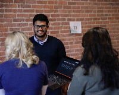

# About Us

**Book compiled by:-**

* **Abhishek Dabas**

Abhishek Dabas is a Graduate Student of the Information Systems Program at Northeastern University. 

[LinkedIn](https://www.linkedin.com/in/adabhishek) \| [Github](https://github.com/abhishekdabas31
) \| [Medium](https://medium.com/@adabhishekdabas
)

* **Abhijit Krishna Menon**

Abhijit is a Graduate student in the Master's of Data Analytics program at Northeastern University. He is currently working as a Machine Learning researcher in the 'Cyber-Security and Privacy Institute'. His research is focussed on action classification of Smart Devices from Network files. Along side this, Abhijit is also working on understanding Causal Inference and building more interpretable models.

His hobbies include playing chess, reading and volunteering in community services.

[Website](https://www.abhijitkmenon.com/) \| [LinkedIn](https://www.linkedin.com/in/abhijit-krishna-menon/)

