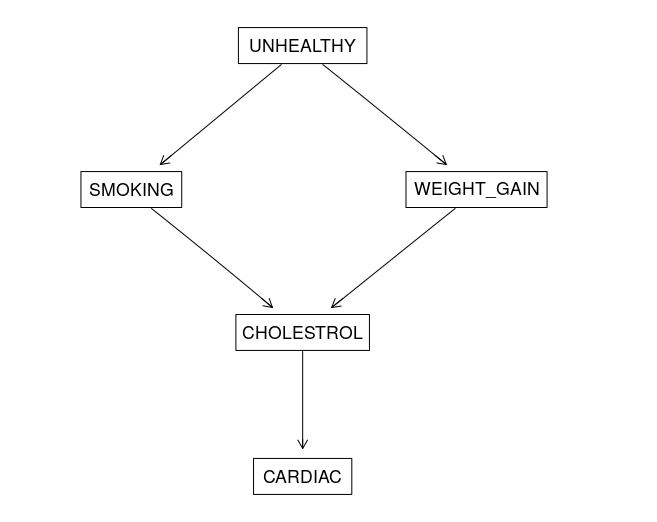

# Testing notebook

In this section, we see programmatic examples as to how to create a **Directed Acyclic Graph** in R using the **bnlearn** package and evaluating probabilistic queries.

## **Installing the Package**

The first step is to install the _**bnlearn**_ **pacakge in R.**

```text
install.packages(bnlearn)

# import the package once installed to verify installation

library(bnlearn)
```

## **Causal graph describing cardiac arrest**

To illustrate **how to create a DAG in R**, we need a process that we can represent with as a DAG. In this example, we look at the relationship between smoking and cardiac arrest.

The causal assumptions are encoded in a DAG. In this process, we **assume unhealthy habits cause them to gain weight and start smoking.** This in turn attributes to cholesterol and which in turn causes cholesterol.



The following DAG can be represented and visualized in R

```text
library(bnlearn)
library(Rgraphviz)

net <- model2network("[UNHEALTHY][SMOKING|UNHEALTHY][WEIGHT_GAIN|UNHEALTHY][CHOLESTROL|SMOKING:WEIGHT_GAIN][CARDIAC|CHOLESTROL]")

graphviz.plot(net, shape="rectangle")
```

The path from smoking to cardiac arrest is directed: smoking causes cholesterol to rise, which then increases the risk of cardiac arrest. Cholesterol is an intermediate variable between smoking and cardiac arrest. Directed paths are also chains because each is causal on the next. Let’s say we also assume that weight causes cholesterol to rise and thus increases the risk of cardiac arrest. Now there’s another chain in the DAG: from weight to cardiac arrest. However, this chain is indirect, at least as far as the relationship between smoking and cardiac arrest goes.

We also assume that a person who smokes is more likely to be someone who engages in other unhealthy behaviors, such as overeating. On the DAG, this is portrayed as a latent \(unmeasured\) node, called an **unhealthy lifestyle.** Having a predilection towards unhealthy behaviors leads to both smoking and increased weight. Here, the **relationship between smoking and weight is through a forked path** \(weight &lt;- unhealthy lifestyle -&gt; smoking\) rather than a chain; because they have a mutual parent, smoking and weight are associated \(in real life, there’s probably a more direct relationship between the two, but we’ll ignore that for simplicity\).

In the following section, we see how to test the d-separation programmatically.

1. Chains \(A-&gt;B-&gt;C\)

```text
bnlearn:::dseparation(bn=net, x = 'SMOKING', y = 'CARDIAC', z = '') 
# Returns False

bnlearn:::dseparation(bn=net, x = 'SMOKING', y = 'CARDIAC', z = 'CHOLESTROL')
# Returns True
```

If we adjust on cholesterol, smoking is d-separated from cardiac arrest.

1. Fork \(B&lt;-A-&gt;C\)

```text
bnlearn:::dseparation(bn=net, x = 'SMOKING', y = 'WEIGHT_GAIN', z = '')
# Returns FALSE

bnlearn:::dseparation(bn=net, x = 'SMOKING', y = 'WEIGHT_GAIN', z = 'UNHEALTHY')
# Returns TRUE
```

If we adjust on or observe an unhealthy life, smoking is d-separated from weight gain.

1. Collider \(B-&gt;A&lt;-C\)

```text
bnlearn:::dseparation(bn=net, x = 'SMOKING', y = 'WEIGHT_GAIN', z = 'CHOLESTROL')
# Returns FALSE
```

This presents an interesting case. What if we observe both unhealthy habits and cholesterol. SMOKING, UNHEALTHY, and WEIGHT GAIN forms a **fork** whereas SMOKING, WEIGHT\_GAIN and CHOLESTEROL form a **collider**. **A statement is d-separated only if all the triplets are themselves d-separated**. In this case, the collider isn't d-separated when observed on cholesterol and hence SMOKING and WEIGHT\_GAIN aren't conditionally independent given we adjust on unhealthy life style and cholesterol.

