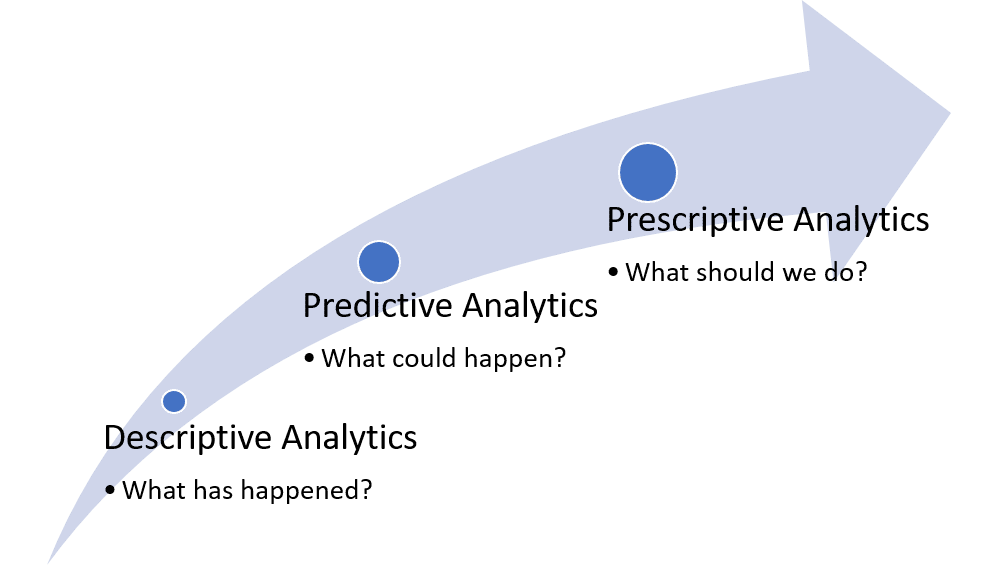

# Decision-Making

**Types of data analysis :**

1. **Descriptive Analysis - What Happened? \(Reports and Data visualization\)**
2. **Predictive Analysis - What will Happen? \(Predictions about future\)**
3. **Prescriptive Analysis - What should we do?The Best decision!! \(Decision Making and proactive actions\)**

**Moving From Predictive to Prescriptive requires Causality**. We need to know, understand, and answer some important questions before making decisions. 

Describe, Predict, and make Causal Inference\(counterfactual prediction\) are 3 very essential steps. Currently, there is excessive use of predictive analysis. **Example**: **Microsoft** built an algorithm to predict pancreatic cancer months before diagnosis, **Facebook's** algorithm to detect users who may be suicidal. These applications have 1 thing in common, **which is that they are predictive models, not causal.** They take data as input and make a prediction which is the output. **They do not consider the counterfactuals and confounders.** This is why automating this process of taking inputs and producing output without human intervention is comparatively easy \(as it does not require any expert knowledge\). 

**Intervention along with the role of expert knowledge** is the main difference between predicting and causal Inference tasks. Causality is not just about expert knowledge though, it also involves expert questions, and identifying \(also helps in generating\) relevant data sources, along with which causal structures are built.

**Decision making requires Causality**. Initially, we train the model and are able to make some predictions. In order to implement it and use it, we need to make decisions based on these predictions we see, as an output from the model. Thus this process of Decision Making requires something more than just prediction, which is where causality is needed. If we want "**Actionable Insights from data**". We need to understand the causal relationships between the variables in the data. 

Almost everything we have done using Statistical Inference is curve fitting. **This is the age of Transparency, which is why we need Causality with our models.**

In business, when data scientists have to undergo the process of decision making, based on the predictions of the model, the "**What-if**" questions arise \(What is something else had happened? Would the outcome be any different?\). Answering these questions is very important in regards to making a correct and accurate decision. **Causal Inference helps in making business decisions by understanding the data driving the model and making effective strategies by understanding the impact of key features.**

**Example**: In a recommendation system, we see that people with more friends online have higher activity online, we build a model with the number of friends and number of logins. When this model goes to people who make decisions, they ask questions. What do we do to increase the online activity of people?, Would an increase in the number of friends people have, increase the social activity of a person? We then realize the factor influencing the number of friends and social activities, if the person is interested in gaming or something like that?

In simple words, we want to know the effect of actions that we might plan on taking. As computing increasingly effects and impacts all walks of life, questions of **cause and effect** are also very critical for design and data**-**driven evaluation for all the computer systems and applications that are built.

**Paradox**: 

* "Simpsons Paradox" made scientists recognize that the choice of data analysis depends on causality. _**Example**_: A generation of medical researchers believed that postmenopausal hormone therapy reduced the risk of heart disease \(which was based just on the data analysis\)

"But there is nothing inevitable about the decision to hand over to a computer the capacity to make decisions for us. There is always a human responsibility and this belongs to the companies or organizations that make use of – or at least unleash – the powers of the computer networks. To pretend otherwise is like blaming the outbreak of the first world war [on railway timetables](http://media.nationalarchives.gov.uk/index.php/railways-and-the-mobilisation-for-war-in-1914/) and their effect on the mobilization of armies." - [By Guardian ](https://www.theguardian.com/commentisfree/2016/oct/23/the-guardian-view-on-machine-learning-people-must-decide)

* **Decision Intelligence:** This new field of Decision Making is now being turned into a whole new field called ****[**Decision Intelligence**](https://en.wikipedia.org/wiki/Decision_intelligence)**.** The right decision or performing better actions from data is what matters at the end of the day.

