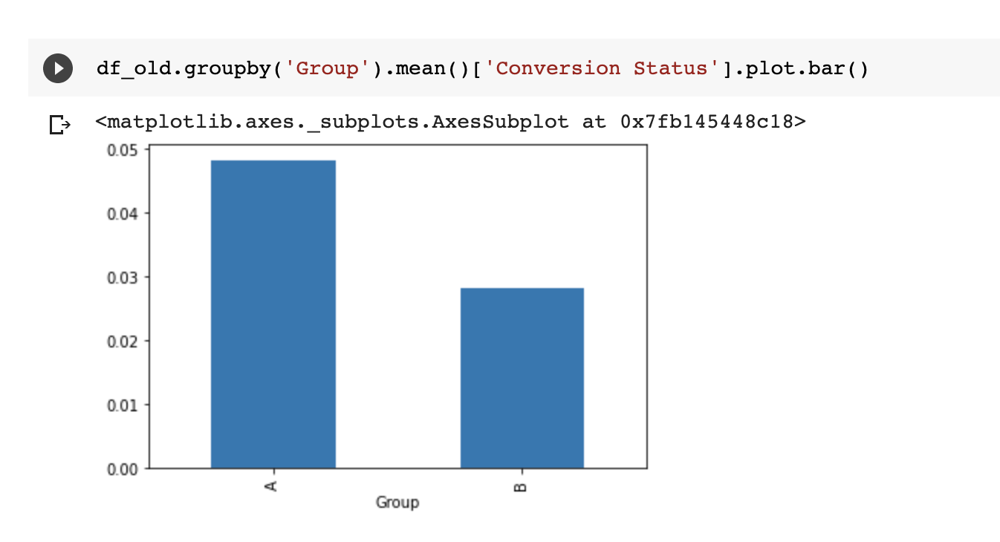
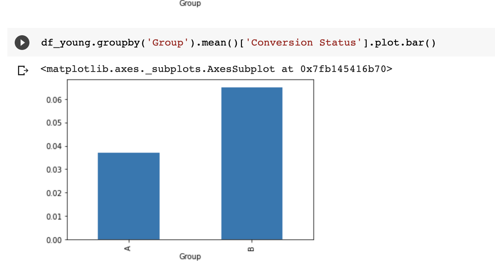

# Implications

**Adding visualization here showing stratification:**

Example: Comparing the Click-Through Rates\(CTR\) for A page and B page.

* **Analysis without stratification:**

A performs a little better than B

* \*\*Analysis on removal of over sampling for Old people in the data set. 

**B performs better than A**

* **Analysis when we stratify on one of the features\("Age"\):**

 

We see that the performance of A and B depends on the age of the person and that is the reason we were getting flawed inferences earlier.

\*\*\*\*

**Go to the** [**Notebook**](https://colab.research.google.com/drive/1d7kytjnvpHsGbJRgEA29ra8M_iAnLFK1?usp=sharing#scrollTo=1M6WAMXaUFOu) **for reference!!!**

