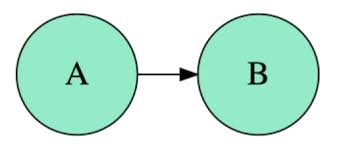
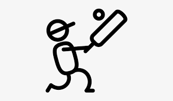
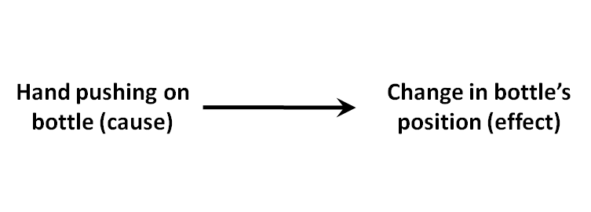
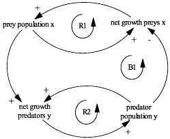

# What is Causality?

Causality describes a **relationship between 2 or more things**, where a change in one causes a change in the other. The essence of causality is a phenomenon of being dependent on another event. Causality revolves around finding the **cause and effect relationship**.

It is usually inferred as the **difference between the outcomes** when a person is given the treatment compared to when the individual is not assigned the treatment.

Causality plays a massive role in the way humans learn to perceive the world around us. All of our understanding of the world initially comes through an understanding of the various causes and effects that surround us. Not just that, but our ability to act around the world comes from a grasp of the causal relationship between the various aspects around the world.

An **example** of this is humans understanding how to play a sport. Imagine a game of baseball/cricket. Until an, unless the person understands that hitting the ball with the bat is going to **cause** the ball to move further away in the opposite direction, the person will never get a grasp of the game.

In the world of **Science**, most of the studies are actually a study of the systematic **cause and effect relationships** between successive events.

An important process in the understanding of a particular cause is the process of induction. Induction relies on having seen a large enough sample space of the particular cause taking place over a continuous period of time. We then project our past uniformity in our experience into our future expectations. We have seen plugging a light bulb into a switch causes the bulb to glow in the past and so we will assume that this will take place in the future as well.

However, this is a very generalistic view of causality. Just because we have seen an even occur in the past, it does not guarantee that it will happen in the future. Just because we see the sunrise and sunset everyday, does not guarantee that it will take place tomorrow.

Causality can roughly be divided into two main parts. 

1. **Linear**
2. **Non-Linear**

## Linear Causality

Linear Causality is the idea that cause and effect follow a single straight line between events. ie. Between A the cause and B the event.

Linear Causality can be though of as a Domino Effect where one event A leads to a sequence of events which finally cause B.

## Non-Linear Causality

Non-Linear Causality is the idea that Causality may follow a bi-directional path. ie. A causes B and B in turn causes A. The causality can either be direct or through a sequence of events.

An example of this is the study on the ecosystem which shows that the population of the predator causes a change in the population of the prey. But also, the population of the prey causes the population of the predator to change

